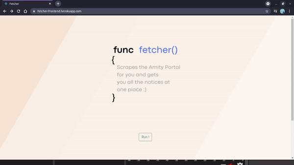

# { Fetcher }

This is the frontend part of a simple web app "Fetcher" made using the **ReactJs** framework.

The app basically gets the user all the notices published on [https://www.amity.edu/placement/default.asp]() at just one place with one click and without any unnecessary stuff.

The backend of the application is made with **Golang** and here is the [repository](https://github.com/saurabhraj042/fetcher-backend) of it.

It is hosted using **Heroku** here [fetcher](https://fetcher-frontend.herokuapp.com/).

